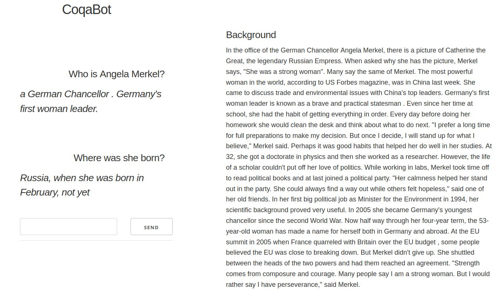

# Seq2Seq Dialogue
## datasets

* [Natural Questions](https://ai.google.com/research/NaturalQuestions/dataset) on [github](https://github.com/google-research-datasets/natural-questions)
    + `wget https://storage.googleapis.com/natural_questions/v1.0-simplified/simplified-nq-train.jsonl.gz`
* [topical-chat](https://github.com/alexa/alexa-prize-topical-chat-dataset)
    + `git clone https://github.com/Shikib/Response-Generation-Baselines.git`
    + `unzip Response-Generation-Baselines/data.zip -d topical-chat`
    ```shell script
    topicalchat-train: 179708
    topicalchat-val-freq: 11273
    topicalchat-val-rare: 11245
    topicalchat-test: 11206
    ```
* [hotpotqa](https://hotpotqa.github.io/); [hotpot-paper](https://nlp.stanford.edu/pubs/yang2018hotpotqa.pdf)
* [coqa](https://stanfordnlp.github.io/coqa/)
* [SQUAD 2.0](https://rajpurkar.github.io/SQuAD-explorer/)
* [convai-challenge](http://convai.io/) and [persona-chat](https://github.com/DeepPavlov/convai)
    + https://gist.github.com/thomwolf/ecc52ea728d29c9724320b38619bd6a6
* [quangaroo](http://qangaroo.cs.ucl.ac.uk/)
    + multi-document QA, how to use? concat documents?? Context way to big to fit in transformer

#### number of seq2seq-examples    
```
topicalchat-train: 182347
personachat-train: 262875
coqa-train: 108646
squad20-train: 86820
coqa-val: 7982
squad20-val: 20301
```
## training
0. build corpus: `python build_seq2seq_corpus.py`
0. train: optionally continue from`--checkpoint=$HOME/data/bart_seq2seq_dialogue_new/checkpointepoch=2.ckpt \`
0. only once run train-command on frontend with `OMP_NUM_THREADS=4` to downloads pretrained model
```shell script
OMP_NUM_THREADS=2 wandb init # on frontend

export PYTHONPATH=~/transformers/examples
CUDA_VISIBLE_DEVICES=1 WANDB_MODE=dryrun python ../transformers/examples/seq2seq/finetune.py \
--data_dir=$HOME/data/seq2seq_dialogue \
--model_name_or_path=sshleifer/distilbart-xsum-12-1 \
--learning_rate=3e-5 \
--max_source_length=1024 \
--max_target_length=128 \
--train_batch_size=2 \
--eval_batch_size=2 \
--output_dir=coqa-distilbart-xsum-12-1 \
--num_train_epochs 3 \
--fp16 \
--gpus 1 \
--do_train \
--do_predict \
--n_val 1000 \
--val_check_interval 0.1 \
--sortish_sampler \
--logger wandb \
--wandb_project seq2seq-chatbot
```

## evaluating
#### [DSTC9-Baseline](https://github.com/dertilo/Response-Generation-Baselines)
* [Transformer trained by Shikib Mehri](https://drive.google.com/file/d/1fPB45RDs_BcJ8KZeYQiauK3W1RsdY2hM/view?usp=sharing)
* [no cheating!](https://github.com/dertilo/Response-Generation-Baselines/commit/030d9335ef3b1f642ac76e86e1a0f52c4d8b9916)
```shell script
export PYTHONPATH=~/code/NLP/transformers/examples
python evaluation.py --pred_file ~/gunther/data/transformer_trained/test_rare_epoch_20.pred --target_file ~/gunther/Response-Generation-Baselines/processed_output/test_rare.tgt
{'f1-scores': {'rouge-1': 0.18832909781578547,
               'rouge-2': 0.047195065416391825,
               'rouge-l': 0.18423218591116589},
 'huggingface-rouge': {'rouge1': 0.1902879866916785,
                       'rouge2': 0.049791688778764095,
                       'rougeL': 0.16477289347786828}}
```
#### huggingface-evaluation
* [coqa-distilbart-xsum-12-1](https://app.wandb.ai/dertilo/seq2seq-chatbot/runs/3ll696ve/overview?workspace=user-)
```shell script
(ml_gpu) [tilo-himmelsbach@gpu010 seq2seq]$ python evaluate_transformer.py 
100%|████| 998/998 [14:02<00:00,  1.18it/s]
{'f1-scores': {'rouge-1': 0.2750953579003743,
               'rouge-2': 0.15929957668606087,
               'rouge-l': 0.28888274540104353},
 'huggingface-rouge': {'rouge1': 0.3280108921933519,
                       'rouge2': 0.19008676583777595,
                       'rougeL': 0.324871404293655}}
```
#### [coqa-baselines-evaluation](https://github.com/stanfordnlp/coqa-baselines)
```shell script
{'bart': {'em': 47.9, 'f1': 65.5, 'turns': 7983},
 'bart-danqi': {'em': 31.6, 'f1': 43.7, 'turns': 7983}, # TODO(tilo): why is danqi not working?
 'cheatbot': {'em': 94.7, 'f1': 97.3, 'turns': 7983}, # should be at 100 percent! but it is not!
 'echobot': {'em': 0.0, 'f1': 3.5, 'turns': 7983}}
```

## dash-frontend
1. on gunther, get model from hpc: `rsync -avz -e "ssh -o StrictHostKeyChecking=no -o UserKnownHostsFile=/dev/null" --exclude=.git tilo-himmelsbach@gateway.hpc.tu-berlin.de:/home/users/t/tilo-himmelsbach/data/bart_seq2seq_dialogue_continued/checkpointepoch=2.ckpt ~/data/bart_coqa_seq2seq/`
2. dash-app in browser: `gunther:8050`



# similar projects
* https://github.com/NTU-SQUAD/transformers-coqa -> extractive QA! not generative!